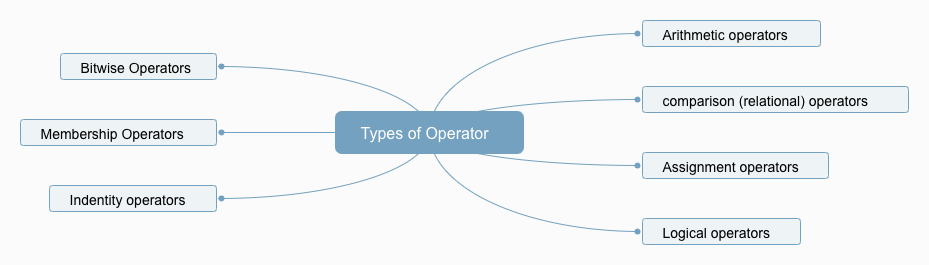
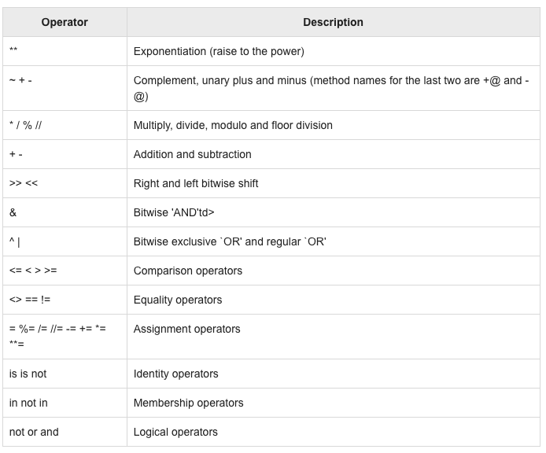

<h1>Table of Contents<span class="tocSkip"></span></h1>
<div class="toc"><ul class="toc-item"><li><span><a href="#Python-operators" data-toc-modified-id="Python-operators-1"><span class="toc-item-num">1&nbsp;&nbsp;</span>Python operators</a></span><ul class="toc-item"><li><span><a href="#What-is-a-operator?" data-toc-modified-id="What-is-a-operator?-1.1"><span class="toc-item-num">1.1&nbsp;&nbsp;</span>What is a operator?</a></span></li><li><span><a href="#Types-of-Operator" data-toc-modified-id="Types-of-Operator-1.2"><span class="toc-item-num">1.2&nbsp;&nbsp;</span>Types of Operator</a></span></li><li><span><a href="#Python-Arithmetic-Operators" data-toc-modified-id="Python-Arithmetic-Operators-1.3"><span class="toc-item-num">1.3&nbsp;&nbsp;</span>Python Arithmetic Operators</a></span><ul class="toc-item"><li><span><a href="#+-Addition" data-toc-modified-id="+-Addition-1.3.1"><span class="toc-item-num">1.3.1&nbsp;&nbsp;</span><code>+</code> Addition</a></span></li><li><span><a href="#--Subtraction" data-toc-modified-id="--Subtraction-1.3.2"><span class="toc-item-num">1.3.2&nbsp;&nbsp;</span><code>-</code> Subtraction</a></span></li><li><span><a href="#*Multiplication" data-toc-modified-id="*Multiplication-1.3.3"><span class="toc-item-num">1.3.3&nbsp;&nbsp;</span><code>*</code>Multiplication</a></span></li><li><span><a href="#/-Division" data-toc-modified-id="/-Division-1.3.4"><span class="toc-item-num">1.3.4&nbsp;&nbsp;</span><code>/</code> Division</a></span></li><li><span><a href="#%-Modulus" data-toc-modified-id="%-Modulus-1.3.5"><span class="toc-item-num">1.3.5&nbsp;&nbsp;</span><code>%</code> Modulus</a></span></li><li><span><a href="#**-Exponent" data-toc-modified-id="**-Exponent-1.3.6"><span class="toc-item-num">1.3.6&nbsp;&nbsp;</span><code>**</code> Exponent</a></span></li><li><span><a href="#//-Floor-Division" data-toc-modified-id="//-Floor-Division-1.3.7"><span class="toc-item-num">1.3.7&nbsp;&nbsp;</span><code>//</code> Floor Division</a></span></li></ul></li><li><span><a href="#Python-comparison-operations" data-toc-modified-id="Python-comparison-operations-1.4"><span class="toc-item-num">1.4&nbsp;&nbsp;</span>Python comparison operations</a></span><ul class="toc-item"><li><span><a href="#==" data-toc-modified-id="==-1.4.1"><span class="toc-item-num">1.4.1&nbsp;&nbsp;</span><code>==</code></a></span></li><li><span><a href="#!=" data-toc-modified-id="!=-1.4.2"><span class="toc-item-num">1.4.2&nbsp;&nbsp;</span><code>!=</code></a></span></li><li><span><a href="#>" data-toc-modified-id=">-1.4.3"><span class="toc-item-num">1.4.3&nbsp;&nbsp;</span><code>&gt;</code></a></span></li><li><span><a href="#<" data-toc-modified-id="<-1.4.4"><span class="toc-item-num">1.4.4&nbsp;&nbsp;</span><code>&lt;</code></a></span></li><li><span><a href="#>=" data-toc-modified-id=">=-1.4.5"><span class="toc-item-num">1.4.5&nbsp;&nbsp;</span><code>&gt;=</code></a></span></li><li><span><a href="#<=" data-toc-modified-id="<=-1.4.6"><span class="toc-item-num">1.4.6&nbsp;&nbsp;</span><code>&lt;=</code></a></span></li></ul></li><li><span><a href="#Python-Assignment-operations" data-toc-modified-id="Python-Assignment-operations-1.5"><span class="toc-item-num">1.5&nbsp;&nbsp;</span>Python Assignment operations</a></span><ul class="toc-item"><li><span><a href="#=" data-toc-modified-id="=-1.5.1"><span class="toc-item-num">1.5.1&nbsp;&nbsp;</span><code>=</code></a></span></li><li><span><a href="#+=-Add-AND" data-toc-modified-id="+=-Add-AND-1.5.2"><span class="toc-item-num">1.5.2&nbsp;&nbsp;</span><code>+=</code> Add AND</a></span></li><li><span><a href="#-=-Subtract-AND" data-toc-modified-id="-=-Subtract-AND-1.5.3"><span class="toc-item-num">1.5.3&nbsp;&nbsp;</span><code>-=</code> Subtract AND</a></span></li><li><span><a href="#*=-Multiply-AND" data-toc-modified-id="*=-Multiply-AND-1.5.4"><span class="toc-item-num">1.5.4&nbsp;&nbsp;</span><code>*=</code> Multiply AND</a></span></li><li><span><a href="#/=-Divide-AND" data-toc-modified-id="/=-Divide-AND-1.5.5"><span class="toc-item-num">1.5.5&nbsp;&nbsp;</span><code>/=</code> Divide AND</a></span></li><li><span><a href="#%-Modulus-AND" data-toc-modified-id="%-Modulus-AND-1.5.6"><span class="toc-item-num">1.5.6&nbsp;&nbsp;</span><code>%</code> Modulus AND</a></span></li><li><span><a href="#**=-Exponent-AND" data-toc-modified-id="**=-Exponent-AND-1.5.7"><span class="toc-item-num">1.5.7&nbsp;&nbsp;</span><code>**=</code> Exponent AND</a></span></li><li><span><a href="#//=-Floor-Division" data-toc-modified-id="//=-Floor-Division-1.5.8"><span class="toc-item-num">1.5.8&nbsp;&nbsp;</span><code>//=</code> Floor Division</a></span></li></ul></li><li><span><a href="#Python-Logical-Operators" data-toc-modified-id="Python-Logical-Operators-1.6"><span class="toc-item-num">1.6&nbsp;&nbsp;</span>Python Logical Operators</a></span><ul class="toc-item"><li><span><a href="#and-Logical-AND" data-toc-modified-id="and-Logical-AND-1.6.1"><span class="toc-item-num">1.6.1&nbsp;&nbsp;</span><code>and</code> Logical AND</a></span></li><li><span><a href="#or-Logical-OR" data-toc-modified-id="or-Logical-OR-1.6.2"><span class="toc-item-num">1.6.2&nbsp;&nbsp;</span><code>or</code> Logical OR</a></span></li><li><span><a href="#not-Logical-NOT" data-toc-modified-id="not-Logical-NOT-1.6.3"><span class="toc-item-num">1.6.3&nbsp;&nbsp;</span><code>not</code> Logical NOT</a></span></li></ul></li><li><span><a href="#Python-Membership-Operators" data-toc-modified-id="Python-Membership-Operators-1.7"><span class="toc-item-num">1.7&nbsp;&nbsp;</span>Python Membership Operators</a></span><ul class="toc-item"><li><span><a href="#in" data-toc-modified-id="in-1.7.1"><span class="toc-item-num">1.7.1&nbsp;&nbsp;</span><code>in</code></a></span></li><li><span><a href="#not-in" data-toc-modified-id="not-in-1.7.2"><span class="toc-item-num">1.7.2&nbsp;&nbsp;</span><code>not in</code></a></span></li></ul></li><li><span><a href="#Python-Identity-Operators" data-toc-modified-id="Python-Identity-Operators-1.8"><span class="toc-item-num">1.8&nbsp;&nbsp;</span>Python Identity Operators</a></span><ul class="toc-item"><li><span><a href="#is" data-toc-modified-id="is-1.8.1"><span class="toc-item-num">1.8.1&nbsp;&nbsp;</span><code>is</code></a></span></li><li><span><a href="#is-not" data-toc-modified-id="is-not-1.8.2"><span class="toc-item-num">1.8.2&nbsp;&nbsp;</span><code>is not</code></a></span></li></ul></li></ul></li><li><span><a href="#Python-Operators-Precedence" data-toc-modified-id="Python-Operators-Precedence-2"><span class="toc-item-num">2&nbsp;&nbsp;</span>Python Operators Precedence</a></span></li></ul></div>

## Python operators

### What is a operator?

Operators are the constructs which can manipulate the value of operands.

Consider the expression 4 + 5 = 9. Here, 4 and 5 are called operands and + is called operator.

### Types of Operator



### Python Arithmetic Operators

#### `+` Addition

Adds values on either side of the operator.


```python
a=10
b=2 
a+b
```


    12


```python
c='Azat'
d='AI'
c+d
```


    'AzatAI'


#### `-` Subtraction

Subtracts right hand operand from left hand operand.


```python
a-b
```


    8


#### `*`Multiplication

multiplies values on either side of the operator


```python
a*b
```


    20


####  `/` Division

Divides left hand operand by right hand operand


```python
a/b
```


    5.0


#### `%` Modulus

Divides left hand operand by right hand operand and returns remainder


```python
a%b
```


    0


#### `**` Exponent


```python
f=2
b**2
```


    4


#### `//` Floor Division

Floor Division - The division of operands where the result is the quotient in which the digits after the decimal point are removed. But if one of the operands is negative, the result is floored, i.e., rounded away from zero (towards negative infinity) −


```python
a//b
```


    5


```python
a//-2
```


    -5


### Python comparison operations

#### `==` 

If the values of two operands are equal, then the condition becomes true.


```python
a==b
```


    False


```python
b==2
```


    True


#### `!=`

If values of two operands are not equal, then condition becomes true.


```python
a!=2
```


    True


```python
b!=2
```


    False


#### `>`

If the value of left operand is greater than the value of right operand, then condition becomes true.


```python
a>b
```


    True


```python
b>3
```


    False


#### `<`

If the value of left operand is less than the value of right operand, then condition becomes true.

#### `>=`

	If the value of left operand is greater than or equal to the value of right operand, then condition becomes true.


```python
a>=b
```


    True


#### `<=`

If the value of left operand is less than or equal to the value of right operand, then condition becomes true.

### Python Assignment operations

#### `=` 

Assigns values from right side operands to left side operand


```python
a=10
```


```python
print(a)
```

    10


#### `+=` Add AND 

adds right operand to the left operand and assign the result to left operand


```python
b=2
```


```python
a+=b    # a=a+b
```


```python
print(a)
```

    12


#### `-=` Subtract AND

It subtracts right operand from the left operand and assign the result to left operand


```python
a-=b # a= a-b
print(a)
```

    10


#### `*=` Multiply AND

It multiplies right operand with the left operand and assign the result to left operand


```python
a*=b # a=a*b
print(a)
```

    20


#### `/=` Divide AND

It divides right operand with the left operand and assign the result to left operand


```python
a/=b # a=a/b
print(a)
```

    5.0


#### `%` Modulus AND

It takes modulus using two operands and assign the result to left operand


```python
a%=b
```


```python
print(a)
```

    1.0


#### `**=` Exponent AND

Performs exponential (power) calculation on operators and assign value to the left operand


```python
a*=b
print(a)
```

    2.0


#### `//=` Floor Division

It performs floor division on operators and assign value to the left operand


```python
a//=b
print(a)
```

    1.0


### Python Logical Operators

#### `and` Logical AND

If both the operands are true then condition becomes true.


```python
a=True
b=False
```


```python
a and b
```


    False


#### `or` Logical OR

If any the operands are true then condition becomes true.


```python
a or b 
```


    True


#### `not` Logical NOT

Used to reverse the logical state of its operand.


```python
not b
```


    True


### Python Membership Operators

#### `in` 

Evaluates to true if it finds a variable in the specified sequence and false otherwise.


```python
some_list = [1,2,3,4,5]
a in some_list
```


    True


```python
90 in some_list
```


    False


#### `not in`

Evaluates to true if it does not finds a variable in the specified sequence and false otherwise.


```python
25 not in some_list
```


    True


### Python Identity Operators

#### `is`

	Evaluates to true if the variables on either side of the operator point to the same object and false otherwise.


```python
a is b
```


    False


```python
type(a) is type(b)
```


    True


#### `is not`

	Evaluates to false if the variables on either side of the operator point to the same object and true otherwise.


```python
a is not b
```


    True


## Python Operators Precedence


