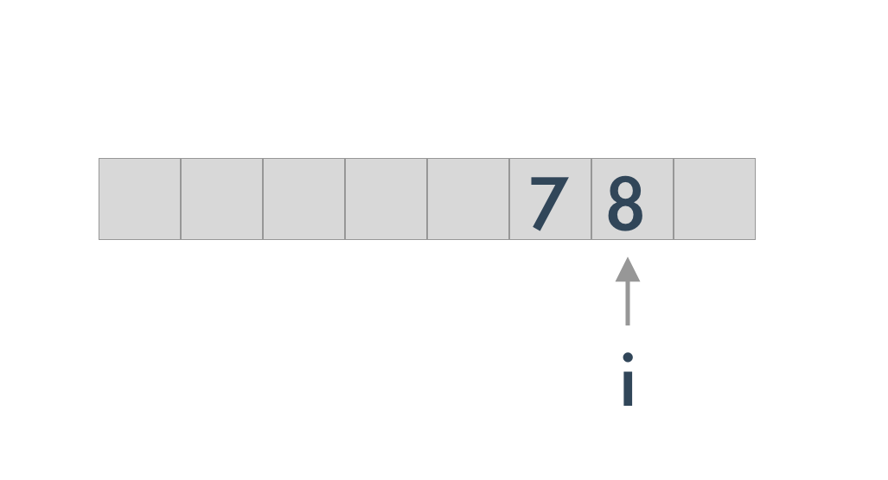
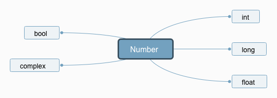
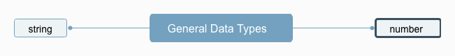
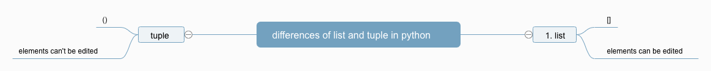
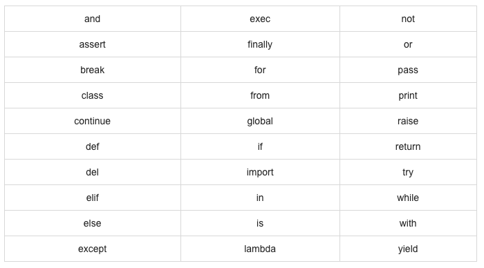

<h1>Table of Contents<span class="tocSkip"></span></h1>
<div class="toc"><ul class="toc-item"><li><span><a href="#Python-constants-and-variables" data-toc-modified-id="Python-constants-and-variables-1"><span class="toc-item-num">1&nbsp;&nbsp;</span>Python constants and variables</a></span><ul class="toc-item"><li><span><a href="#constant" data-toc-modified-id="constant-1.1"><span class="toc-item-num">1.1&nbsp;&nbsp;</span>constant</a></span></li><li><span><a href="#Constant-application" data-toc-modified-id="Constant-application-1.2"><span class="toc-item-num">1.2&nbsp;&nbsp;</span>Constant application</a></span></li><li><span><a href="#What-is-a-variable?" data-toc-modified-id="What-is-a-variable?-1.3"><span class="toc-item-num">1.3&nbsp;&nbsp;</span>What is a variable?</a></span></li><li><span><a href="#Assignment" data-toc-modified-id="Assignment-1.4"><span class="toc-item-num">1.4&nbsp;&nbsp;</span>Assignment</a></span></li><li><span><a href="#Application-of-variables" data-toc-modified-id="Application-of-variables-1.5"><span class="toc-item-num">1.5&nbsp;&nbsp;</span>Application of variables</a></span></li></ul></li><li><span><a href="#Python-numbers-and-strings" data-toc-modified-id="Python-numbers-and-strings-2"><span class="toc-item-num">2&nbsp;&nbsp;</span>Python numbers and strings</a></span><ul class="toc-item"><li><span><a href="#Number-type" data-toc-modified-id="Number-type-2.1"><span class="toc-item-num">2.1&nbsp;&nbsp;</span>Number type</a></span></li><li><span><a href="#What-is-a-string?" data-toc-modified-id="What-is-a-string?-2.2"><span class="toc-item-num">2.2&nbsp;&nbsp;</span>What is a string?</a></span></li><li><span><a href="#Use-of-quotes" data-toc-modified-id="Use-of-quotes-2.3"><span class="toc-item-num">2.3&nbsp;&nbsp;</span>Use of quotes</a></span></li><li><span><a href="#Escapes" data-toc-modified-id="Escapes-2.4"><span class="toc-item-num">2.4&nbsp;&nbsp;</span>Escapes</a></span></li><li><span><a href="#natural-string" data-toc-modified-id="natural-string-2.5"><span class="toc-item-num">2.5&nbsp;&nbsp;</span>natural string</a></span></li><li><span><a href="#Repeating-the-string" data-toc-modified-id="Repeating-the-string-2.6"><span class="toc-item-num">2.6&nbsp;&nbsp;</span>Repeating the string</a></span></li><li><span><a href="#Substring" data-toc-modified-id="Substring-2.7"><span class="toc-item-num">2.7&nbsp;&nbsp;</span>Substring</a></span></li></ul></li><li><span><a href="#Python-data-types" data-toc-modified-id="Python-data-types-3"><span class="toc-item-num">3&nbsp;&nbsp;</span>Python data types</a></span><ul class="toc-item"><li><span><a href="#General-data-types" data-toc-modified-id="General-data-types-3.1"><span class="toc-item-num">3.1&nbsp;&nbsp;</span>General data types</a></span></li><li><span><a href="#list" data-toc-modified-id="list-3.2"><span class="toc-item-num">3.2&nbsp;&nbsp;</span>list</a></span></li><li><span><a href="#tuple" data-toc-modified-id="tuple-3.3"><span class="toc-item-num">3.3&nbsp;&nbsp;</span>tuple</a></span></li><li><span><a href="#set" data-toc-modified-id="set-3.4"><span class="toc-item-num">3.4&nbsp;&nbsp;</span>set</a></span></li><li><span><a href="#dict" data-toc-modified-id="dict-3.5"><span class="toc-item-num">3.5&nbsp;&nbsp;</span>dict</a></span></li></ul></li><li><span><a href="#Python-Keywords-and-Identifiers" data-toc-modified-id="Python-Keywords-and-Identifiers-4"><span class="toc-item-num">4&nbsp;&nbsp;</span>Python Keywords and Identifiers</a></span><ul class="toc-item"><li><span><a href="#What-is-a-python-identifier" data-toc-modified-id="What-is-a-python-identifier-4.1"><span class="toc-item-num">4.1&nbsp;&nbsp;</span>What is a python identifier</a></span></li><li><span><a href="#Rules-for-writing-identifiers" data-toc-modified-id="Rules-for-writing-identifiers-4.2"><span class="toc-item-num">4.2&nbsp;&nbsp;</span>Rules for writing identifiers</a></span></li><li><span><a href="#Reserved-keywords-in-python" data-toc-modified-id="Reserved-keywords-in-python-4.3"><span class="toc-item-num">4.3&nbsp;&nbsp;</span>Reserved keywords in python</a></span></li></ul></li><li><span><a href="#Object-in-Python" data-toc-modified-id="Object-in-Python-5"><span class="toc-item-num">5&nbsp;&nbsp;</span>Object in Python</a></span><ul class="toc-item"><li><span><a href="#pickle-in-Python" data-toc-modified-id="pickle-in-Python-5.1"><span class="toc-item-num">5.1&nbsp;&nbsp;</span>pickle in Python</a></span></li></ul></li></ul></div>
## Python constants and variables

### constant

The amount that cannot be made during the execution of the program is a constant;
The amount that can be changed during program execution is a variable;

### Constant application


```python
# Write a constant class; (How do you define constants in other programming languages?)
class _const(object):
    class ConstError(TypeError):pass
    def __setattr__(self,name,value):
        if  name in self.__dict__:
            raise self.ConstError("Can't rebind const(%s)"%name) 
        self.__dict__[name]=value
    def __delattr__(self,name):
        if name in self.__dict__:
            raise self.ConstError("Can't unbind const(%s)"%name)
        raise NameError(name)
```


```python
PI = _const()
PI.value = 3.14
```


```python
print(PI.value)
```

    3.14


```python
PI.value = 3.141
```


    ---------------------------------------------------------------------------
    
    ConstError                                Traceback (most recent call last)
    
    <ipython-input-93-6aa4732b946f> in <module>
    ----> 1 PI.value = 3.141


    <ipython-input-90-6146a4177e35> in __setattr__(self, name, value)
          4     def __setattr__(self,name,value):
          5         if  name in self.__dict__:
    ----> 6             raise self.ConstError("Can't rebind const(%s)"%name)
          7         self.__dict__[name]=value
          8     def __delattr__(self,name):


    ConstError: Can't rebind const(value)


### What is a variable?

A variable is the amount that can be changed while the program is executing (think of the variable x in math)

### Assignment

Assignment is actually to give an address in memory that stores the specified data. For example:

``` python
i = 7
```
The meaning is: There is a place in memory where the number `7` is stored, let our `i` go to specify this place.


### Application of variables


```python
i = 7
```


```python
print(i)
```


```python
i = i+1
```


```python
print(i)
```


```python
i += 1
```


```python
print(i)
```


```python
i +=2
```


```python
print(i)
```


```python
# change
i=8
```

We can assign a different value to the variable.


## Python numbers and strings

### Number type



0,1,-1,1009,-20 `int`

878871,-900954,234587964548545154 `long`

2.748,3.14159648798985,8.258,-0.245 `float`

True, False `bool`

4+2j,-9+32j,  a+bj  `complex`

### What is a string?

'hello', 'myPython', '2+3', "Hello World", ''' Ok, I'm coming now!'''   `string`

### Use of quotes


```python
# ''
c1 = 'AzatAI'
print(c1)
```

    AzatAI


```python
# ''
c2 = 'It is a "dog"'
print(c2)
```

    It is a "dog"


You can use double quotes `""` in single quotes, and double quotes can be output.


```python
# ''
c3 = 'it is a 'dog''
print(c3)
```


      File "<ipython-input-3-48c2067d9d47>", line 2
        c3 = 'it is a 'dog''
                         ^
    SyntaxError: invalid syntax


`''` Single quotes can't be used in single quotes `''`, otherwise it will cause a syntax error. Similarly, `"` can't be nested with `"`


```python
# ""
c4 = "AzatAI"
print(c4)
```

    AzatAI


```python
# ""
c5 = "It's a dog!"
print(c5)
```

    It's a dog!


```python
# """"""
#''''''

c6 = '''"It's a dog!",he said. '''
c7 = """"It's a dog!",he said. """
```


```python
print(c6)
```

    "It's a dog!",he said. 


```python
print(c7)
```

    "It's a dog!",he said. 


The triple quotes can be wrapped and the format will be preserved.


```python
c8 = '''
A:What's your name?
B:I don't have a name, I am machine intelligence.
'''
```


```python
print(c8)
```


    A:What's your name?
    B:I don't have a name, I am machine intelligence.


### Escapes


```python
# \ ### Escapes
print('it's a dog')
```


      File "<ipython-input-94-63b4d9cdf029>", line 2
        print('it's a dog')
                  ^
    SyntaxError: invalid syntax


```python
print('it\'s a dog')
```

    it's a dog


```python
print('hello boys\nhello girls')
```

    hello boys
    hello girls


### natural string

In order to preserve our style, just put a `r` in front of the quotes.


```python
print('hello boys\nhello girls')
```

    hello boys
    hello girls


```python
print(r'hello boys\nhello girls')
```

    hello boys\nhello girls


```python
print(f'hello boys\nhello girls')
```

    hello boys
    hello girls


### Repeating the string


```python
print('AzatAI')
print('AzatAI')
print('AzatAI')
```

    AzatAI
    AzatAI
    AzatAI


```python
print('AzatAI\n'*3)
```

    AzatAI
    AzatAI
    AzatAI


```python
print('hello'*20)
```

    hellohellohellohellohellohellohellohellohellohellohellohellohellohellohellohellohellohellohellohello


```python
print('hello girl!\n'*20)
```

    hello girl!
    hello girl!
    hello girl!
    hello girl!
    hello girl!
    hello girl!
    hello girl!
    hello girl!
    hello girl!
    hello girl!
    hello girl!
    hello girl!
    hello girl!
    hello girl!
    hello girl!
    hello girl!
    hello girl!
    hello girl!
    hello girl!
    hello girl!


### Substring


```python
c10 = 'AzatAI' #this is the father string
c11 = 'Azat'  # this is a child string (substring)
c12 = 'AI' # this is also a child string
c13 = 'AzatA' # this is also a child string
c14 = 'atAI' # this is also a child string
```

How to get a child string from the father string?


```python
print(c10[0])
```

    A


```python
print(c10[-1])
```

    I


```python
print(c10[0:3])
```

    Aza


[a:b] means, start from a (include a ) to b (not including b)


```python
print(c10[0:4])
```

    Azat


## Python data types

### General data types



### list

`[]`  
list has order.  


```python
# python list
student = ['Aydar','Aray','Aryslan','Alma']
print(student)
```

    ['Aydar', 'Aray', 'Aryslan', 'Alma']


```python
print(student[2])
```

    Aryslan


### tuple

a tuple also can store a list, but tuple is different from a list in two ways:  
1. symbol for list is [], but for tuple it's ()  
2. list elements canbe read and written, but elemts in tuple can't be edited.




```python
# python list
student = ['Aydar','Aray','Aryslan','Alma']
print(student)
print(student[2])
```

    ['Aydar', 'Aray', 'Aryslan', 'Alma']
    Aryslan


```python
student[2] = 'Nursultan'
```


```python
print(student)
```

    ['Aydar', 'Aray', 'Nursultan', 'Alma']


```python
# python tuple
student = ('Aydar','Aray','Aryslan','Alma')
print(student)
print(student[2])
```

    ('Aydar', 'Aray', 'Aryslan', 'Alma')
    Aryslan


```python
student[2] = 'Nursultan'
```


    ---------------------------------------------------------------------------
    
    TypeError                                 Traceback (most recent call last)
    
    <ipython-input-36-9ef92298d933> in <module>
    ----> 1 student[2] = 'Nursultan'


    TypeError: 'tuple' object does not support item assignment


### set

1. `set()`  
2. items in set can not be repeated


```python
a=set("abcdefgrrrhsyf")
b=set("cdefghtyd")
```


```python
print(a)
```

    {'h', 'y', 'e', 'b', 'd', 'f', 's', 'g', 'r', 'a', 'c'}


```python
print(b)
```

    {'h', 'y', 'e', 'f', 'd', 't', 'g', 'c'}


A `set` is an unordered data structure.


```python
print(a&b) # tems included both in a and b 
```

    {'h', 'y', 'e', 'd', 'f', 'g', 'c'}


```python
print(a|b)  #all items included in a and b
```

    {'b', 'f', 't', 's', 'r', 'a', 'h', 'y', 'e', 'd', 'g', 'c'}


```python
print(a-b)  #items that included in a but not in b
```

    {'s', 'a', 'b', 'r'}


###  dict

looks like a `json` and acts like a json, but has the name as `dict`


```python
student = {
    'name':'Aryslan',
    'id':'95102245986',
    'university':'kaznu',
    'city':'almaty'
}
```

python dict format:

``` python
d = {
    <key>: <value>,
    <key>: <value>,
      .
      .
      .
    <key>: <value>
}
```


```python
print(student)
```

    {'name': 'Aryslan', 'id': '95102245986', 'university': 'kaznu', 'city': 'almaty'}


```python
print(student['name'])
```

    Aryslan


```python
print(student['id'])
```

    95102245986


```python
student['class']=2
```


```python
print(student)
```

    {'name': 'Aryslan', 'id': '95102245986', 'university': 'kaznu', 'city': 'almaty', 'class': 2}


```python
student['city']='Nursultan'
```


```python
print(student['city'])
```

    Nursultan


```python
del student['class']
```


```python
print(student)
```

    {'name': 'Aryslan', 'id': '95102245986', 'university': 'kaznu', 'city': 'Nursultan'}


```python
'city' in student
```


    True


```python
'class' in student
```


    False


```python
len(student)
```


    4


```python
student.get('id')
```


    '95102245986'


```python
student.get('class')
```


```python
student.items()
```


    dict_items([('name', 'Aryslan'), ('id', '95102245986'), ('university', 'kaznu'), ('city', 'Nursultan')])


```python
list(student.items())
```


    [('name', 'Aryslan'),
     ('id', '95102245986'),
     ('university', 'kaznu'),
     ('city', 'Nursultan')]


```python
print(student.keys())
```

    dict_keys(['name', 'id', 'university', 'city'])


```python
list(student.keys())
```


    ['name', 'id', 'university', 'city']


```python
student.values()
```


    dict_values(['Aryslan', '95102245986', 'kaznu', 'Nursultan'])


```python
list(student.values())
```


    ['Aryslan', '95102245986', 'kaznu', 'Nursultan']


```python
student.pop('city')
```


    'Nursultan'


```python
print(student)
```

    {'name': 'Aryslan', 'id': '95102245986', 'university': 'kaznu'}


```python
info1 = {
    'name':'Arystan',
    'id':'22',
    'city':'Almaty'
}

info2 = {
    'city':'Nursultan',
    'university':'kaznu'
}
```


```python
info1.update(info2)
```


```python
print(info1)
```

    {'name': 'Arystan', 'id': '22', 'city': 'Nursultan', 'university': 'kaznu'}


## Python Keywords and Identifiers

###  What is a python identifier

An identifier is a name given to entities like class, functions, variables, etc. It helps to differentiate one entity from another.

simply it is a name like `Nurzhan`, `Almas`, `Sholpan`

### Rules for writing identifiers

1. Identifiers can be a combination of letters or `_`  
2. An identifier cannot start with a digit.  
3. Keywords cannot be used as identifiers.  
4. We cannot use special symbols like !, @, #, $, % etc. in our identifier.  
5. Identifier can be of any length.


```python
3ll = [] #❌❌❌
```


      File "<ipython-input-102-673d3ad9f463>", line 1
        3ll = [] #❌❌❌
          ^
    SyntaxError: invalid syntax


```python
dict = '233' # ❌❌❌
```


```python
ew&#@w = 'Something' #❌❌❌
```


      File "<ipython-input-104-1bf99c574419>", line 1
        ew&#@w = 'Something' #❌❌❌
                                 ^
    SyntaxError: invalid syntax


NOTE:
* `Name` and `name` is different identifier in Python  
* Generally: Class names start with an uppercase letter. All other identifiers start with a lowercase letter.

### Reserved keywords in python

Reserved keywords in python are:  **(you can't any of these as a identifier in your project!!!)**



## Object in Python

Everything is an object in Python.  

### pickle in Python

 Any object in python can be pickled so that it can be saved on disk.

 What pickle does is that it “serialises” the object first before writing it to file. Pickling is a way to convert a python object (list, dict, etc.) into a character stream. The idea is that this character stream contains all the information necessary to reconstruct the object in another python script.


```python
import pickle
# dumps(object) pickle any object
lista=['Build','the','future']
listb=pickle.dumps(lista)
print(listb)
```

    b'\x80\x03]q\x00(X\x05\x00\x00\x00Buildq\x01X\x03\x00\x00\x00theq\x02X\x06\x00\x00\x00futureq\x03e.'


 loads(string) recover the original pickle ,at the same time the original datatype of the object will be recovered.


```python
#load 
listc = pickle.loads(listb)
print(listc)
```

    ['Build', 'the', 'future']


```python
# dump(object,file) save the pickled file on the disk
group1 = ('google','microsoft','amazon','apple')
with open('1.azt','wb') as f:
    pickle.dump(group1,f,True)
```


```python
# load the pickled file from disk
with open('1.azt','rb') as f1:
    t = pickle.load(f1)
```


```python
print(t)
```

    ('google', 'microsoft', 'amazon', 'apple')

