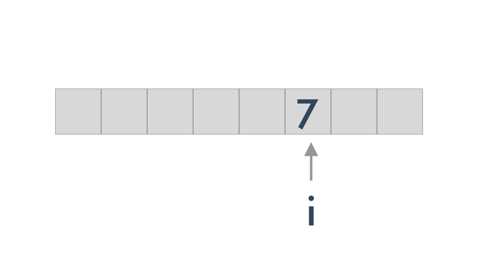

<h1>Table of Contents<span class="tocSkip"></span></h1>
<div class="toc"><ul class="toc-item"><li><span><a href="#Everything-is-an-object" data-toc-modified-id="Everything-is-an-object-1"><span class="toc-item-num">1&nbsp;&nbsp;</span>Everything is an object</a></span></li><li><span><a href="#type,-object-and-class" data-toc-modified-id="type,-object-and-class-2"><span class="toc-item-num">2&nbsp;&nbsp;</span>type, object and class</a></span><ul class="toc-item"><li><span><a href="#type" data-toc-modified-id="type-2.1"><span class="toc-item-num">2.1&nbsp;&nbsp;</span>type</a></span></li></ul></li><li><span><a href="#Built-in-types-of-Python" data-toc-modified-id="Built-in-types-of-Python-3"><span class="toc-item-num">3&nbsp;&nbsp;</span>Built in types of Python</a></span><ul class="toc-item"><li><span><a href="#Three-characteristics-of-the-object" data-toc-modified-id="Three-characteristics-of-the-object-3.1"><span class="toc-item-num">3.1&nbsp;&nbsp;</span>Three characteristics of the object</a></span><ul class="toc-item"><li><span><a href="#object-identity" data-toc-modified-id="object-identity-3.1.1"><span class="toc-item-num">3.1.1&nbsp;&nbsp;</span>object identity</a></span></li><li><span><a href="#object-type" data-toc-modified-id="object-type-3.1.2"><span class="toc-item-num">3.1.2&nbsp;&nbsp;</span>object type</a></span></li><li><span><a href="#object-value" data-toc-modified-id="object-value-3.1.3"><span class="toc-item-num">3.1.3&nbsp;&nbsp;</span>object value</a></span></li><li><span><a href="#None" data-toc-modified-id="None-3.1.4"><span class="toc-item-num">3.1.4&nbsp;&nbsp;</span>None</a></span></li><li><span><a href="#numbers" data-toc-modified-id="numbers-3.1.5"><span class="toc-item-num">3.1.5&nbsp;&nbsp;</span>numbers</a></span><ul class="toc-item"><li><span><a href="#int" data-toc-modified-id="int-3.1.5.1"><span class="toc-item-num">3.1.5.1&nbsp;&nbsp;</span><code>int</code></a></span></li><li><span><a href="#float" data-toc-modified-id="float-3.1.5.2"><span class="toc-item-num">3.1.5.2&nbsp;&nbsp;</span><code>float</code></a></span></li><li><span><a href="#complex" data-toc-modified-id="complex-3.1.5.3"><span class="toc-item-num">3.1.5.3&nbsp;&nbsp;</span><code>complex</code></a></span></li><li><span><a href="#bool" data-toc-modified-id="bool-3.1.5.4"><span class="toc-item-num">3.1.5.4&nbsp;&nbsp;</span><code>bool</code></a></span></li></ul></li></ul></li><li><span><a href="#Sequence-type" data-toc-modified-id="Sequence-type-3.2"><span class="toc-item-num">3.2&nbsp;&nbsp;</span>Sequence type</a></span><ul class="toc-item"><li><span><a href="#list" data-toc-modified-id="list-3.2.1"><span class="toc-item-num">3.2.1&nbsp;&nbsp;</span><code>list</code></a></span></li><li><span><a href="#bytes,bytearray,memoryview" data-toc-modified-id="bytes,bytearray,memoryview-3.2.2"><span class="toc-item-num">3.2.2&nbsp;&nbsp;</span>bytes,bytearray,memoryview</a></span></li><li><span><a href="#range" data-toc-modified-id="range-3.2.3"><span class="toc-item-num">3.2.3&nbsp;&nbsp;</span>range</a></span></li><li><span><a href="#tuple" data-toc-modified-id="tuple-3.2.4"><span class="toc-item-num">3.2.4&nbsp;&nbsp;</span><code>tuple</code></a></span></li><li><span><a href="#str" data-toc-modified-id="str-3.2.5"><span class="toc-item-num">3.2.5&nbsp;&nbsp;</span><code>str</code></a></span></li><li><span><a href="#array" data-toc-modified-id="array-3.2.6"><span class="toc-item-num">3.2.6&nbsp;&nbsp;</span><code>array</code></a></span></li></ul></li><li><span><a href="#dict" data-toc-modified-id="dict-3.3"><span class="toc-item-num">3.3&nbsp;&nbsp;</span><code>dict</code></a></span></li><li><span><a href="#set" data-toc-modified-id="set-3.4"><span class="toc-item-num">3.4&nbsp;&nbsp;</span><code>set</code></a></span><ul class="toc-item"><li><span><a href="#set" data-toc-modified-id="set-3.4.1"><span class="toc-item-num">3.4.1&nbsp;&nbsp;</span><code>set</code></a></span></li><li><span><a href="#frozenset" data-toc-modified-id="frozenset-3.4.2"><span class="toc-item-num">3.4.2&nbsp;&nbsp;</span><code>frozenset</code></a></span></li></ul></li><li><span><a href="#with" data-toc-modified-id="with-3.5"><span class="toc-item-num">3.5&nbsp;&nbsp;</span><code>with</code></a></span></li><li><span><a href="#Others" data-toc-modified-id="Others-3.6"><span class="toc-item-num">3.6&nbsp;&nbsp;</span>Others</a></span><ul class="toc-item"><li><span><a href="#Module" data-toc-modified-id="Module-3.6.1"><span class="toc-item-num">3.6.1&nbsp;&nbsp;</span>Module</a></span></li><li><span><a href="#class" data-toc-modified-id="class-3.6.2"><span class="toc-item-num">3.6.2&nbsp;&nbsp;</span>class</a></span></li><li><span><a href="#function" data-toc-modified-id="function-3.6.3"><span class="toc-item-num">3.6.3&nbsp;&nbsp;</span>function</a></span></li><li><span><a href="#method" data-toc-modified-id="method-3.6.4"><span class="toc-item-num">3.6.4&nbsp;&nbsp;</span>method</a></span></li><li><span><a href="#code" data-toc-modified-id="code-3.6.5"><span class="toc-item-num">3.6.5&nbsp;&nbsp;</span>code</a></span></li><li><span><a href="#object" data-toc-modified-id="object-3.6.6"><span class="toc-item-num">3.6.6&nbsp;&nbsp;</span>object</a></span></li><li><span><a href="#type" data-toc-modified-id="type-3.6.7"><span class="toc-item-num">3.6.7&nbsp;&nbsp;</span>type</a></span></li><li><span><a href="#elipsis" data-toc-modified-id="elipsis-3.6.8"><span class="toc-item-num">3.6.8&nbsp;&nbsp;</span>elipsis</a></span></li><li><span><a href="#notimplemented" data-toc-modified-id="notimplemented-3.6.9"><span class="toc-item-num">3.6.9&nbsp;&nbsp;</span>notimplemented</a></span></li></ul></li></ul></li></ul></div>

##  Everything is an object


```python
def ask(name='AzatAI'):
    print(name)
    
my_func = ask() # what this doing is initializing the function, that means the function will run when we initialize it.
```

    AzatAI


```python
my_func2 = ask # assign the function to a variable.
my_func2('Hello')
```

    Hello


```python
class Person:
    def __init__(self):
        print('Hello')
        
my_class = Person
```


```python
my_class
```


    __main__.Person


```python
my_class()
```

    Hello


    <__main__.Person at 0x7ffb50489350>


```python
obj_list = []
obj_list.append(ask)
obj_list.append(Person)
for item in obj_list:
    print(item())
```

    AzatAI
    None
    Hello
    <__main__.Person object at 0x7ffb806f2350>


item is asking for the function return value, however if we do non't return anything in a function, the function will return `None`


```python
def decorator_func():
    print('dec start')
    return ask
```


```python
my_ask = decorator_func()
my_ask('Tom')
```

    dec start
    Tom


##  type, object and class

### type


```python
a=1
```


```python
b='abc'
```


```python
type(1)
```


    int


```python
type(int)
```


    type


```python
type(a)
```


    int


type->int->1


```python
type(b)
```


    str


```python
type('abc')
```


    str


```python
type(str)
```


    type


type -> str - > 'abc


```python
class Student():
    pass

class MyStudent():
    pass

stu = Student()
```


```python
type(stu)
```


    __main__.Student


```python
type(Student)
```


    type


type -> class - > obj

From above it's not hard to find that:

`class` is generated from `type` and `obj` is generated from `class` 


type - > class -> obj


```python
type(int)
```


    type


```python
type(1)
```


    int


```python
type(type)
```


    type


```python
a=1
```


```python
type(a)
```


    int


```python
print(type(a))
```

    <class 'int'>


```python
print(type(int))
```

    <class 'type'>


```python
Student.__base__
```


    object


```python
class MyStudent(Student):
    pass
```


```python
MyStudent.__base__
```


    __main__.Student


Then we can find that all class is inherited from `obj`


```python
type.__base__
```


    object


This means type is an object, and `type` inherited from `object`


```python
type(object)
```


    type


```python
object.__base__
```


```python
print(object.__base__)
```

    None


That means object is the top level class and did't inherited from anything.

## Built in types of Python

### Three characteristics of the object

#### object identity

object identity is the object's stored address of object in memory. we can get a object's identity by `id` method.


```python
a=5
id(a)
```


    4515498928


```python
b=[]
id(b)
```


    140718168212576


```python
a=6
```


```python
id(a)
```


    4515498960


```python
id(5)
```


    4515498928


```python
id(6)
```


    4515498960





#### object type


```python
type(1)
```


    int


```python
type(a)
```


    int


```python
type(b)
```


    list


#### object value


```python
a
```


    6


```python
b
```


    []


```python
print(a)
```

    6


```python
print(b)
```

    []


```python
### Python object types
```

#### None

`None` object type can be one and only one in the global environment.


```python
a=None
```


```python
b=None
```


```python
a==b
```


    True


```python
id(a)
```


    4515197016


```python
id(b)
```


    4515197016


As we can see, both a and b stored in the same place in the memory.

#### numbers

#####  `int`


```python
type(100)
```


    int


```python
type(1)
```


    int


```python
type(-32)
```


    int


#####  `float`


```python
type(3.14159)
```


    float


```python
type(3.21)
```


    float


##### `complex`


```python
type(3+2j)
```


    complex


##### `bool`


```python
type(True)
```


    bool


```python
type(False)
```


    bool


### Sequence type

#### `list`


```python
type([])
```


    list


#### bytes,bytearray,memoryview


```python
type(b'\\213')
```


    bytes


#### range

#### `tuple`


```python
type((2,3))
```


    tuple


#### `str`


```python
type('AzatAI')
```


    str


#### `array`

### `dict`

### `set`

#### `set`

#### `frozenset`

### `with`


### Others

#### Module

#### class

#### function

#### method

#### code

#### object

#### type

#### elipsis

#### notimplemented
